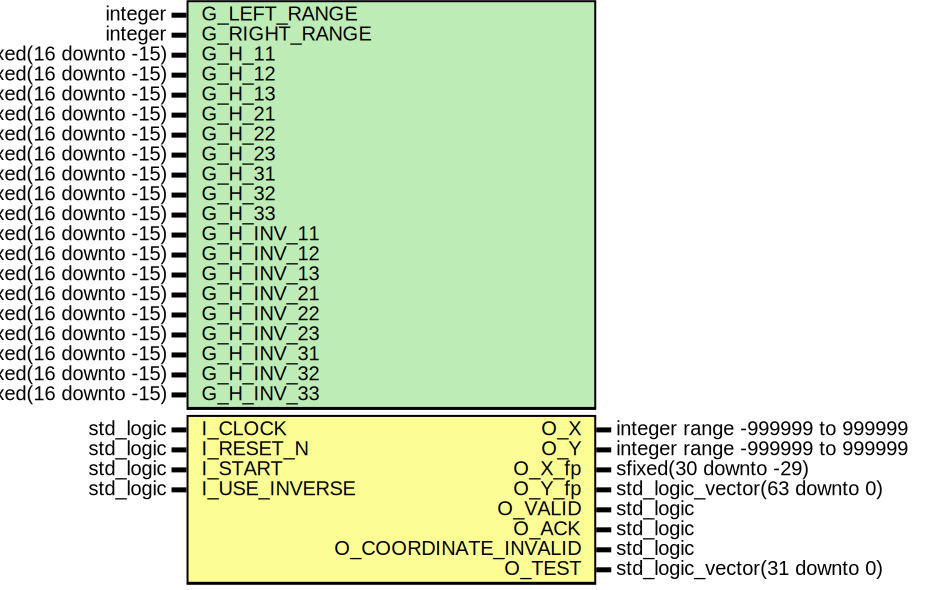
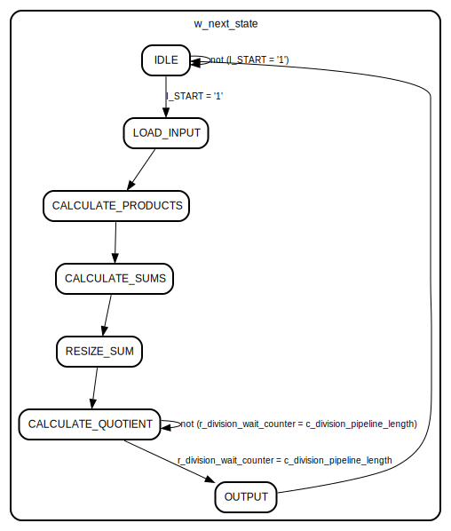

# Entity: RECTIFICATION 
- **File**: Rectification.vhd

## Diagram

## Description

This component calculates, based on the stored transformation matrix,
the corresponding coordinate based on an input coordinate.
It's able to do forward and reverse transformation, thus
both matrices have to be passed.

## Generics

| Generic name  | Type                  | Value                             | Description                                  |
| ------------- | --------------------- | --------------------------------- | -------------------------------------------- |
| G_LEFT_RANGE  | integer               | 16                                |                                              |
| G_RIGHT_RANGE | integer               | -15                               |                                              |
| G_H_11        | sfixed(16 downto -15) | to_sfixed(-0.01092232, 16, -15)   | Forward transformation matrix element (1, 1) |
| G_H_12        | sfixed(16 downto -15) | to_sfixed(0.00013470, 16, -15)    | Forward transformation matrix element (1, 1) |
| G_H_13        | sfixed(16 downto -15) | to_sfixed(-0.05616105, 16, -15)   | Forward transformation matrix element (1, 3) |
| G_H_21        | sfixed(16 downto -15) | to_sfixed(-0.00032707, 16, -15)   | Forward transformation matrix element (2, 1) |
| G_H_22        | sfixed(16 downto -15) | to_sfixed(-0.01072320, 16, -15)   | Forward transformation matrix element (2, 2) |
| G_H_23        | sfixed(16 downto -15) | to_sfixed(-0.31203785, 16, -15)   | Forward transformation matrix element (2, 3) |
| G_H_31        | sfixed(16 downto -15) | to_sfixed(-0.00000085, 16, -15)   | Forward transformation matrix element (3, 1) |
| G_H_32        | sfixed(16 downto -15) | to_sfixed(0.00000003, 16, -15)    | Forward transformation matrix element (3, 2) |
| G_H_33        | sfixed(16 downto -15) | to_sfixed(-0.01047320, 16, -15)   | Forward transformation matrix element (3, 3) |
| G_H_INV_11    | sfixed(16 downto -15) | to_sfixed(-91.56217754, 16, -15)  | Reverse transformation matrix element (1, 1) |
| G_H_INV_12    | sfixed(16 downto -15) | to_sfixed(-1.14885521, 16, -15)   | Reverse transformation matrix element (1, 2) |
| G_H_INV_13    | sfixed(16 downto -15) | to_sfixed(525.21807432, 16, -15)  | Reverse transformation matrix element (1, 3) |
| G_H_INV_21    | sfixed(16 downto -15) | to_sfixed(2.57622553, 16, -15)    | Reverse transformation matrix element (2, 1) |
| G_H_INV_22    | sfixed(16 downto -15) | to_sfixed(-93.21663066, 16, -15)  | Reverse transformation matrix element (2, 2) |
| G_H_INV_23    | sfixed(16 downto -15) | to_sfixed(2763.47553403, 16, -15) | Reverse transformation matrix element (2, 3) |
| G_H_INV_31    | sfixed(16 downto -15) | to_sfixed(0.00744236, 16, -15)    | Reverse transformation matrix element (3, 1) |
| G_H_INV_32    | sfixed(16 downto -15) | to_sfixed(-0.00014027, 16, -15)   | Reverse transformation matrix element (3, 2) |
| G_H_INV_33    | sfixed(16 downto -15) | to_sfixed(-95.51752670, 16, -15)  | Reverse transformation matrix element (3, 3) |

## Ports

| Port name            | Direction | Type                            | Description                                                                                                          |
| -------------------- | --------- | ------------------------------- | -------------------------------------------------------------------------------------------------------------------- |
| I_CLOCK              | in        | std_logic                       |                                                                                                                      |
| I_RESET_N            | in        | std_logic                       |                                                                                                                      |
| I_START              | in        | std_logic                       | Signal to start a transformation                                                                                     |
| I_X                  |           | signed(21 downto 0)             | x-component of the base coordinate                                                                                   |
| I_Y                  |           | signed(21 downto 0)             | x-component of the base coordinate                                                                                   |
| I_USE_INVERSE        | in        | std_logic                       | Which matrix should be used?                                                                                         |
| O_X                  | out       | integer range -999999 to 999999 | Transformed x-coordinate in **integer** format                                                                       |
| O_Y                  | out       | integer range -999999 to 999999 | Transformed y-coordinate in **integer** format                                                                       |
| O_X_fp               | out       | sfixed(30 downto -29)           |                                                                                                                      |
| O_Y_fp               | out       | std_logic_vector(63 downto 0)   |                                                                                                                      |
| O_VALID              | out       | std_logic                       |                                                                                                                      |
| O_ACK                | out       | std_logic                       |                                                                                                                      |
| O_COORDINATE_INVALID | out       | std_logic                       | If the reverse transformation is used, this signal   shows if the base coordinate is inside the source image or not. |
| O_TEST               | out       | std_logic_vector(31 downto 0)   |                                                                                                                      |

## Signals

| Name                     | Type                                      | Description                                                                  |
| ------------------------ | ----------------------------------------- | ---------------------------------------------------------------------------- |
| r_current_state          | t_states                                  |                                                                              |
| w_next_state             | t_states                                  |                                                                              |
| r_homogenous_coordinates | t_homogenous_coordinates                  |                                                                              |
| r_hom_coord_1            | sfixed(33 downto -30)                     |                                                                              |
| r_hom_coord_2            | sfixed(33 downto -30)                     |                                                                              |
| r_hom_coord_3            | sfixed(33 downto -30)                     |                                                                              |
| r_hom_coord_sum_1        | sfixed(35 downto -30)                     |                                                                              |
| r_hom_coord_sum_2        | sfixed(35 downto -30)                     |                                                                              |
| r_hom_coord_sum_3        | sfixed(35 downto -30)                     |                                                                              |
| r_hom_coord_sum_res_1    | sfixed(G_LEFT_RANGE downto G_RIGHT_RANGE) |                                                                              |
| r_hom_coord_sum_res_2    | sfixed(G_LEFT_RANGE downto G_RIGHT_RANGE) |                                                                              |
| r_hom_coord_sum_res_3    | sfixed(G_LEFT_RANGE downto G_RIGHT_RANGE) |                                                                              |
| r_hom_coord_div_1        | sfixed(32 downto -31)                     |                                                                              |
| r_hom_coord_div_2        | sfixed(32 downto -31)                     |                                                                              |
| r_hom_coord_div_3        | sfixed(32 downto -31)                     |                                                                              |
| r_hom_coord_in_1         | sfixed(G_LEFT_RANGE downto G_RIGHT_RANGE) | Stores the first element of the homogenous base coordinate                   |
| r_hom_coord_in_2         | sfixed(G_LEFT_RANGE downto G_RIGHT_RANGE) | Stores the second element of the homogenous base coordinate                  |
| r_hom_coord_in_3         | sfixed(G_LEFT_RANGE downto G_RIGHT_RANGE) | Stores the third element of the homogenous base coordinate                   |
| r_use_inverse            | std_logic                                 |                                                                              |
| r_product_11             | sfixed(33 downto -30)                     |                                                                              |
| r_product_12             | sfixed(33 downto -30)                     |                                                                              |
| r_product_13             | sfixed(33 downto -30)                     |                                                                              |
| r_product_21             | sfixed(33 downto -30)                     |                                                                              |
| r_product_22             | sfixed(33 downto -30)                     |                                                                              |
| r_product_23             | sfixed(33 downto -30)                     |                                                                              |
| r_product_31             | sfixed(33 downto -30)                     |                                                                              |
| r_product_32             | sfixed(33 downto -30)                     |                                                                              |
| r_product_33             | sfixed(33 downto -30)                     |                                                                              |
| r_result_x               | integer range -999999 to 999999999        |                                                                              |
| r_result_y               | integer range -999999 to 999999999        |                                                                              |
| r_x_valid                | std_logic                                 | If one coordinate component is invalid, the whole coordinate won't be valid. |
| r_y_valid                | std_logic                                 |                                                                              |
| r_result_valid           | std_logic                                 |                                                                              |
| r_ack                    | std_logic                                 |                                                                              |
| r_coordinate_invalid     | std_logic                                 |                                                                              |
| r_division_wait_counter  | integer range 0 to 70                     |                                                                              |
| r_result_x_slv           | std_logic_vector(G_LEFT_RANGE downto 0)   |                                                                              |
| r_result_y_slv           | std_logic_vector(G_LEFT_RANGE downto 0)   |                                                                              |
| r_div_enable             | std_logic                                 |                                                                              |
| r_div_x_a                | std_logic_vector(63 downto 0)             |                                                                              |
| r_div_y_a                | std_logic_vector(63 downto 0)             |                                                                              |
| r_div_b                  | std_logic_vector(31 downto 0)             |                                                                              |
| w_div_result_x           | std_logic_vector(63 downto 0)             |                                                                              |
| w_div_result_y           | std_logic_vector(63 downto 0)             |                                                                              |
| w_div_remain_x           | std_logic_vector(31 downto 0)             |                                                                              |
| w_div_remain_y           | std_logic_vector(31 downto 0)             |                                                                              |
| r_div_clear              | std_logic                                 |                                                                              |

## Constants

| Name                       | Type                                      | Value                                                                                                                                                                                                                                                                                                                                                                                                                                                                                                                      | Description                                             |
| -------------------------- | ----------------------------------------- | -------------------------------------------------------------------------------------------------------------------------------------------------------------------------------------------------------------------------------------------------------------------------------------------------------------------------------------------------------------------------------------------------------------------------------------------------------------------------------------------------------------------------- | ------------------------------------------------------- |
| c_homography               | t_homography                              | (      (        G_H_11,         G_H_12,         G_H_13      ),       (        G_H_21,         G_H_22,         G_H_23      ),       (        G_H_31,         G_H_32,         G_H_33      )    )                                     | Matrix elements combined to one array, for convenience. |
| c_homography_inv           | t_homography                              | (      (        G_H_INV_11,         G_H_INV_12,         G_H_INV_13      ),       (        G_H_INV_21,         G_H_INV_22,         G_H_INV_23      ),       (        G_H_INV_31,         G_H_INV_32,         G_H_INV_33      )    ) | Matrix elements combined to one array, for convenience. |
| c_0                        | sfixed(G_LEFT_RANGE downto G_RIGHT_RANGE) | to_sfixed(0,  G_LEFT_RANGE,  G_RIGHT_RANGE)                                                                                                                                                                                                                                                                                                                                                                                                          |                                                         |
| c_division_pipeline_length | integer                                   | 64                                                                                                                                                                                                                                                                                                                                                                                                                                                                                                                         |                                                         |

## Types

| Name                     | Type                                                                                                                                                                                                                                                                                                                   | Description |
| ------------------------ | ---------------------------------------------------------------------------------------------------------------------------------------------------------------------------------------------------------------------------------------------------------------------------------------------------------------------- | ----------- |
| t_homography             |                                                                                                                                                                                                                                                                                                                        |             |
| t_homogenous_coordinates |                                                                                                                                                                                                                                                                                                                        |             |
| t_states                 | (IDLE,  LOAD_INPUT,  CALCULATE_PRODUCTS,  CALCULATE_SUMS,  RESIZE_SUM,  CALCULATE_QUOTIENT,  OUTPUT) |             |

## Processes
- PROC_ASYNC: ( r_current_state, I_START, r_division_wait_counter )
- PROC_SYNC: ( I_CLOCK, I_RESET_N )

## Instantiations

- div: divide_ip
- div_y: divide_ip

## State machines

